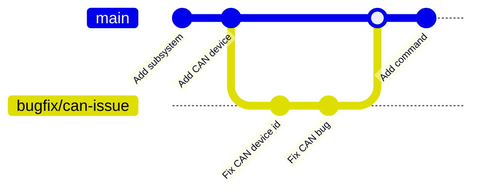

# CONTRIBUTING

These guidelines are primarily for new students to understand the Git process and how to start contributing to the repository. Following these guidelines helps prevent poor code practices and streamlines development. It also allows us to program and review code efficiently, using a method that builds high-quality code and supports collaboration.

> [!NOTE]
> Content marked with [REC] are not required to be followed. But this standard is designed to simplify development and build consistency.

##### Table of Contents  
- [CONTRIBUTING](#contributing)
  * [Issues](#issues)
    + [How to report a bug](#how-to-report-a-bug)
    + [How to suggest a feature](#how-to-suggest-a-feature)
  * [Code Review Process](#code-review-process)
  * [Conventions](#conventions)
    + [Commit Messages](#commit-messages)
    + [Branches](#branches)
      - [Features `feat/`](#features--feat--)
      - [Bug Fixes `bugfix/`](#bug-fixes--bugfix--)
      - [Hot Fixes `hotfix/`](#hot-fixes--hotfix--)
    + [Core Branches](#core-branches)
      - [Main `main`](#main--main-)
      - [Releases `releases/v1.0.0`](#releases--releases-v100-)
    + [Competition Branches](#competition-branches)
    + [Development Branches](#development-branches)
      - [Development `dev`](#development--dev-)
      - [Competition Development `gainesville/dev` `gwinnett/dev`](#competition-development--gainesville-dev---gwinnett-dev-)
  * [Workflow](#workflow)
  * [Contact](#contact)

## Issues

Creating issues is an efficient way to work on bugs or new features on the robot. Additionally, this approach also keeps track of bugs in history for future reference.

[Click here to create an issue](https://github.com/Chargers-4189/Rebuilt-2026/issues/new/choose)

### How to report a bug

Fill out an issue and use the `Bug report` template. Ensure you report the bug in detail to make it easier to debug.

[Click here to create a bug report](https://github.com/Chargers-4189/Rebuilt-2026/issues/new?template=bug_report.md)

Creating an issue will alert others to the bug, allowing them to offer insight or possible solutions. Once a fix is found, you can create a branch based on development or the branch you're working on. Use the prefix `bugfix/`; refer to the branch naming convention for more information.

### How to suggest a feature

Fill out an issue and use the `Feature request` template. Use this template to plan out ideas, subsystems, and more.

[Click here to create a feature request](https://github.com/Chargers-4189/Rebuilt-2026/issues/new?template=feature_request.md)

## Code Review Process

Code reviews are done via pull requests into the main branch. These ensure that the code merging does not have prominent errors or bugs. Then, developers on the team approve the code or request changes. Adhering to the proper conventions will generally streamline this process.

> [!TIP]
> If you have any questions about the process, please contact @Aviator2276.

## Conventions

### Commit Messages [REC]

Keep the name clear and concise, accurately describing the topic. Limit the length to around 50 characters or less. You can use the description for more informative messages. Use present tense and an imperative mood.

### Branches [REC]

Keep the name clear and concise, accurately describing the topic. Limit the length to around 30 characters or less. It must also be lowercase and hyphen-separated. Lastly, always use a prefix to denote the topic.

> [!TIP]
>  When naming your branch, write the full path to the last level. Never start or end a branch with `/`

Here are the prefixes you can use to denote the topic of your branch.
#### Features `feat/`
These branches are used to develop new features and encompass all active development. When creating a new feature, branch off from `dev` to keep the latest code.

- Feature name must be at least 3 characters long
- Feature name must be hyphen-seperated and lowercase

E.g. `feat/swervedrive-auto`

#### Bug Fixes `bugfix/`
Bug fixes address code issues. When creating a bug fix, create an issue first to document it, then branch off from `dev` or the branch you're working on. Fix the problem and create a pull request to merge it back to the desired branch.

- Bug name must be at least 3 characters long
- Bug name must be hyphen-seperated and lowercase

E.g. `bugfix/can-issue`

### Core Branches

> [!WARNING]
>  No direct commits are allowed on these branches. Pull requests are ALWAYS required for merging code.

#### Main `main`
The main branch contains the latest working code of the robot. Since this code must be stable (or compiling at the very least), a pull request is required before a push can be merged. Code approvals/reviews are recommended but not necessary.

## Workflow
Before you jump in and start contributing, it’s a good idea to get familiar with the Git Workflow. The power of GitHub ensures that the version history is maintained and multiple versions are retained. Likewise, the code is checked for errors with pull requests to prevent further problems. This allows us to build high-quality code and collaborate efficiently. If you would like to learn more, read [here](https://github.com/Chargers-4189/git-lesson/blob/main/github-course.md#workflow)

## Contact
As always, please email or Discord us if you need help or have a question.

Have fun and happy hacking!